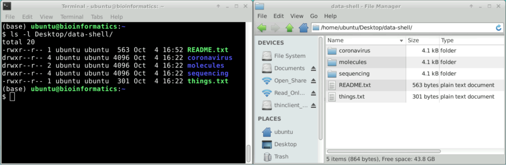

# Powłoka Unix (The Unix Shell)

::: {.callout-tip}
## Cele szkolenia

- Poznać zalety korzystania z wiersza poleceń Unix w porównaniu z graficznym interfejsem użytkownika (GUI).
- Nauczyć się uruchamiać polecenia oraz modyfikować ich działanie za pomocą opcji i argumentów.
- Zrozumieć strukturę dokumentacji narzędzi i sposób uzyskiwania pomocy (`--help`, `man`).

:::

## Wprowadzenie

W ramach tych lekcji przedstawimy podstawy pracy z **wierszem poleceń systemu Unix** (Unix Command Line). Czym właściwie jest wiersz poleceń?

Człowiek komunikuje się z komputerem na różne sposoby: za pomocą klawiatury i myszy, ekranów dotykowych czy rozpoznawania mowy. Najbardziej rozpowszechnioną formą interakcji z komputerami osobistymi jest **graficzny interfejs użytkownika** (GUI – *Graphical User Interface*). W interfejsie graficznym wydajemy instrukcje klikając myszą w okna, ikony i elementy menu.

Choć klikanie przycisków w GUI jest początkowo intuicyjne, wyobraź sobie wykonywanie tej samej operacji setki lub tysiące razy – ręka szybko się zmęczy, a ryzyko pomyłki drastycznie wzrośnie!

Wyobraźmy sobie zadanie typowe dla inżynierii danych satelitarnych: mamy katalog zawierający tysiące plików metadanych scen satelitarnych (np. z misji Sentinel lub Landsat) i musimy wyodrębnić informację o stopniu zachmurzenia (Cloud Cover) oraz dacie akwizycji z trzeciej linii każdego pliku, a następnie podsumować wyniki.  
Korzystając z GUI, spędzilibyśmy wiele godzin na żmudnym klikaniu i otwieraniu każdego pliku z osobna, łatwo popełniając błąd.  
Właśnie w takich zastosowaniach powłoka Unix staje się niezastąpionym narzędziem.

Powłoka Unix to zarówno **interfejs wiersza poleceń** (CLI – *Command-Line Interface*), jak i **język skryptowy**, pozwalający na szybką i w pełni automatyczną realizację powtarzalnych zadań. Za pomocą odpowiednich poleceń powłoka może wykonać daną operację tysiące razy w ułamku sekundy.

{#fig-gui-cli fig-alt="Zrzuty ekranu terminala i menedżera plików prezentujące te same pliki i katalogi"}

## Powłoka (The Shell)

Powłoka (*shell*) to program, w którym użytkownik wprowadza polecenia tekstowe. Za jej pośrednictwem można jednym poleceniem wywołać zaawansowane narzędzia do przetwarzania danych teledetekcyjnych i geoprzestrzennych (np. GDAL, narzędzia SNAP, skrypty Pythona) lub proste instrukcje tworzące katalogi.  
Najpopularniejszą powłoką systemu Unix jest **_Bash_** (*Bourne Again SHell*). Jest ona domyślną powłoką w większości dystrybucji Linuksa oraz w pakietach udostępniających narzędzia uniksowe dla systemu Windows.

Opanowanie wiersza poleceń wymaga pewnego czasu i praktyki. O ile GUI wyświetla gotowe opcje do kliknięcia, o tyle w CLI polecenia trzeba wprowadzać samodzielnie, przyswajając je stopniowo jak słownictwo w nowym języku.

Składnia powłoki pozwala na łączenie prostych narzędzi w wydajne potoki przetwarzania danych (*pipelines*) oraz automatyczną obsługę wielkich zbiorów danych satelitarnych (Big Data / Earth Observation). Sekwencje poleceń można zapisywać w postaci **skryptów**, co zapewnia pełną powtarzalność i odtwarzalność analiz naukowej i inżynierskiej.

Wiersz poleceń jest także podstawowym sposobem interakcji ze zdalnymi serwerami obliczeniowymi, klastrami HPC (*High Performance Computing*) i infrastrukturą chmurową (np. Copernicus Data Space Ecosystem, AWS, CREODIAS).

::: {.callout-tip collapse=true}
#### Nazewnictwo: Unix, Linux, Shell, Terminal, Wiersz poleceń

Często pojęcia takie jak „shell”, „wiersz poleceń”, „bash” i „terminal” są używane zamiennie. Warto jednak znać precyzyjne różnice:

- **Terminal** – aplikacja (okno), która umożliwia interakcję z komputerem za pomocą poleceń tekstowych.
- **Powłoka (Shell)** – interpreter poleceń, który tłumaczy wpisany tekst na konkretne instrukcje dla systemu operacyjnego. Przykładem innego interpretera w systemie Windows jest [Wiersz polecenia (cmd.exe)](https://en.wikipedia.org/wiki/Cmd.exe) lub PowerShell.
- **Bash** – konkretny język i interpreter powłoki Unix. Istnieją również inne powłoki, np. [*Zsh*](https://en.wikipedia.org/wiki/Z_shell) (domyślna w nowszych wersjach macOS).

Podobnie wygląda relacja pojęć Unix, Linux i Ubuntu:

- **Unix** – rodzina systemów operacyjnych o określonej architekturze, z której wywodzą się m.in. _Linux_ i _macOS_.
- **Linux** – rodzina systemów operacyjnych opartych na otwartoźródłowym jądrze (kernelu) Linuksa.
- **Ubuntu** – jedna z najpopularniejszych dystrybucji systemu Linux (inne to np. Debian, Fedora, CentOS, Rocky Linux). Z punktu widzenia pracy w wierszu poleceń działają one niemal identycznie.

:::

## Uruchamianie poleceń

Po otwarciu terminala pojawia się **znak zachęty** (*prompt*), informujący, że powłoka oczekuje na wprowadzenie danych. Typowy znak zachęty w Linuksie wygląda następująco:

```bash
username@machine:~$
```

Zawiera on nazwę użytkownika (`username`), nazwę komputera (`machine`), bieżącą lokalizację w systemie plików (`~` oznacza katalog domowy) oraz symbol dolara `$ `, po którym kursor oczekuje na wpisanie polecenia.  
Po wpisaniu polecenia naciskamy klawisz <kbd>Enter ↵</kbd>, aby je wykonać.

Wypróbujmy nasze pierwsze polecenie: `ls` (skrót od *list*). Służy ono do wyświetlenia zawartości bieżącego katalogu:

```bash
ls
```

```output
Documents    Downloads    Music        Public
Desktop      Movies       Pictures     Templates
```

Zawartość ta może się różnić w zależności od systemu operacyjnego i struktury plików na Twoim dysku.

::: {.callout-warning}
#### Błąd: Command not found
Jeśli powłoka nie może znaleźć programu o podanej nazwie, wyświetli komunikat o błędzie:

```bash
ks
```

```output
ks: command not found
```

Oznacza to, że nazwa polecenia została wpisana z błędem lub odpowiedni pakiet nie jest zainstalowany w systemie.
:::

## Opcje i argumenty poleceń

{fig-alt="Anatomia polecenia powłoki: nazwa programu, opcje, argument pozycyjny"}

Działanie poleceń można modyfikować za pomocą **opcji** (flag/przełączników) oraz **argumentów**. Przeanalizujmy poniższy przykład:

```bash
ls -l --sort time Desktop/data-shell
```

- `ls` to nazwa **polecenia** (programu).
- `-l` to **opcja krótka** (flaga), która zmienia sposób wyświetlania na tzw. format długi (*long format*), pokazujący uprawnienia, rozmiar i datę modyfikacji plików. Opcje krótkie zaczynają się od pojedynczego myślnika (`-`).
- `--sort` to **opcja długa** (zaczynająca się od dwóch myślników `--`), która wymaga podania wartości (w tym przypadku `time`, co powoduje sortowanie plików według czasu modyfikacji).
- `Desktop/data-shell` to **argument pozycyjny** wskazujący, na jakim obiekcie polecenie ma wykonać operację (tutaj: ścieżka do katalogu).

Poszczególne elementy polecenia muszą być rozdzielone spacjami. Jeśli pominiemy spację między `ls` a `-l`, powłoka spróbuje uruchomić nieistniejące polecenie `ls-l`.  
W systemach Unix wielkość liter ma kluczowe znaczenie: `ls -r` (odwrócony porządek sortowania) to co innego niż `ls -R` (rekurencyjne przeglądanie podkatalogów).

## Uzyskiwanie pomocy

Polecenie `ls` (jak i większość narzędzi Unix) posiada wiele opcji. Istnieją dwa podstawowe sposoby sprawdzania dostępnych opcji i składni polecenia:

1. Przekazanie opcji `--help`, np. `ls --help`.
2. Otwarcie podręcznika systemowego poleceniem `man`, np. `man ls`.  
   Aby wyjść z podręcznika `man`, naciskamy klawisz <kbd>Q</kbd> (*quit*).

::: {.callout-note}
#### Strony podręcznika man
Podręcznik `man` jest dostępny dla standardowych narzędzi systemowych. Specjalistyczne pakiety naukowe i inżynierskie (np. pakiety do przetwarzania danych satelitarnych) zazwyczaj udostępniają pomoc poprzez flagi `--help` lub `-h`.
:::

Struktura pomocy narzędzi wiersza poleceń jest zazwyczaj zbliżona. Zobaczmy to na przykładzie fikcyjnego narzędzia do analizy danych satelitarnych `satprocess`:

```text
satprocess is a CLI tool for processing satellite imagery metadata and raster bands.

Usage: 
 satprocess [options] -o <dir> <file1> … <fileN>

Arguments (mandatory): 
 -o, --output=PATH  The path to the output results directory

Options:
 -t, --threads=N    The number of CPU cores to use.
 --cloud-mask       Apply automatic cloud and shadow masking.
 --help             Print this help message and exit.
```

- Na początku podany jest krótki opis narzędzia.
- W sekcji *Usage* pokazany jest schemat wywołania. Nawiasy ostrokątne `<` i `>` oznaczają wartość, którą musi podać użytkownik (samych znaków `< >` nie wpisujemy w poleceniu!).
  - Poprawnie: `-o wyniki`
  - Błędnie: `-o <wyniki>`
- Argumenty wejściowe (`<file1> ... <fileN>`) powinny znaleźć się na końcu polecenia:
  - Poprawnie: `satprocess -o wyniki scena1.tif scena2.tif`
  - Błędnie: `satprocess scena1.tif scena2.tif -o wyniki`
- Oznaczenie `[options]` wskazuje opcje opcjonalne. Ich kolejność nie ma znaczenia:
  - Poprawnie: `satprocess --cloud-mask -o wyniki scena1.tif`
  - Poprawnie: `satprocess -o wyniki --cloud-mask scena1.tif`
- Opcje krótkie i długie są równoważne: `-o wyniki` to to samo co `--output=wyniki`.

Inny często spotykany zapis składni w dokumentacji:

```text
satprocess --output STR [--cloud-mask] [--threads INT] FILE1 [...] [FILEN]
```

W takim zapisie:
- `[]` oznacza parametry opcjonalne,
- `STR` oznacza wartość tekstową (*string*),
- `INT` oznacza liczbę całkowitą (*integer*).

:::{.callout-note}
#### Różnice: macOS vs Linux
System macOS korzysta z narzędzi wywodzących się ze środowiska BSD, podczas gdy dystrybucje Linuksa używają narzędzi GNU Coreutils.  
Większość poleceń działa identycznie, jednak niektóre zaawansowane flagi (np. `ls --sort` czy `sed -i`) mogą różnić się składnią między macOS a Linuksem.
:::

## Podsumowanie

::: {.callout-tip}
#### Główne punkty

- Wiersz poleceń powłoki Unix (CLI) umożliwia automatyzację złożonych operacji na danych geoprzestrzennych i satelitarnych, pracę na klastrach obliczeniowych (HPC/Cloud) oraz tworzenie w pełni powtarzalnych skryptów.
- Podstawowa składnia polecenia to: `polecenie -opcje argumenty`.  
  Na przykład: `ls -l Documents` wyświetla zawartość katalogu `Documents` w formacie szczegółowym (*long format*).
- Aby wyświetlić dokumentację i listę opcji danego polecenia, używamy flagi `--help` (np. `ls --help`) lub polecenia `man` (np. `man ls`).

:::
