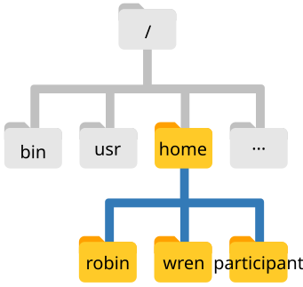

# Nawigacja w systemie plików (Navigating the filesystem)

::: {.callout-tip}

#### Cele szkolenia

- Zrozumieć hierarchiczną strukturę systemu plików oraz sposób określania lokalizacji zasobów.
- Odróżniać ścieżki bezwzględne (*absolute paths*) od ścieżek względnych (*relative paths*).
- Rozpoznawać znaczenie ukośnika `/` jako katalogu głównego (*root*) oraz jako separatora ścieżek.
- Sprawnie poruszać się w drzewie katalogów przy użyciu poleceń `pwd`, `ls` oraz `cd`.
- Poznać standard nazewnictwa produktów misji satelitarnej **Sentinel-2** (`.SAFE`).
- Wykorzystywać symbole wieloznaczne (*wildcards*, np. `*`, `?`) do operacji na grupach plików satelitarnych i telemetrycznych.
- Korzystać z polecenia `find` do wyszukiwania plików i katalogów według kryteriów.

:::

## System plików w systemie Unix

Część systemu operacyjnego odpowiedzialna za zarządzanie plikami i folderami to **system plików** (*filesystem*).
Organizuje on dane w **pliki** oraz **katalogi** (foldery), które mogą zawierać pliki lub inne podkatalogi.
Struktura ta jest hierarchiczna i można ją przedstawić w postaci odwróconego drzewa.

<p align="center">
  
</p>

Na powyższym schemacie widzimy katalogi domowe trzech użytkowników: `robin`, `wren` oraz `participant` (reprezentujący nasze konto szkoleniowe).
Wszystkie katalogi użytkowników znajdują się wewnątrz folderu `home`.
Z kolei folder `home` znajduje się w tzw. **katalogu głównym systemu** (*root directory*), oznaczanym pojedynczym ukośnikiem `/`.
Katalog główny to najwyższy poziom w hierarchii całego systemu operacyjnego (nie można wyjść „wyżej” niż `/`).

W wierszu poleceń wskazujemy pliki i katalogi za pomocą ich „adresu”, czyli **ścieżki** (*path*).
Sprawdźmy naszą bieżącą pozycję w systemie za pomocą polecenia `pwd` (*print working directory* – wypisz katalog roboczy):

```bash
pwd
```

```output
/home/participant
```

W odpowiedzi system wyświetla `/home/participant` – jest to nasz **katalog domowy** (*home directory*), otwierany domyślnie po uruchomieniu nowego terminala.  
`participant` to nasza nazwa użytkownika (*username*).

Zwróćmy uwagę na konstrukcję ścieżki:
- `/` na samym początku oznacza **katalog główny systemu** (*root*).
- `home` to nazwa podkatalogu w katalogu głównym.
- Kolejny `/` pełni rolę **separatora** między katalogami.
- `participant` to docelowy katalog w tej ścieżce.

::: {.callout-important}
#### Dwa znaczenia ukośnika `/`
Znak ukośnika `/` na samym początku ścieżki oznacza katalog główny systemu (*root*).
Znak `/` umieszczony wewnątrz ścieżki pełni rolę separatora oddzielającego poszczególne poziomy katalogów.
:::

::: {.callout-note}
#### Różnice w ścieżkach katalogu domowego
Format ścieżki katalogu domowego zależy od systemu operacyjnego:
- Linux: `/home/nazwa_uzytkownika`
- macOS: `/Users/nazwa_uzytkownika`
- Windows: `C:\Users\nazwa_uzytkownika` (w terminalach uniksowych, np. WSL/Git Bash: `/c/Users/...` lub `/mnt/c/Users/...`)
:::

## Wyświetlanie zawartości katalogów (`ls`)

Aby zobaczyć listę plików i katalogów w bieżącym miejscu, używamy polecenia `ls` (*list*):

```bash
ls
```

```output
Desktop    Documents    Downloads    dane_do_cwiczen
```

Nasz rozpakowany pakiet danych satelitarnych znajduje się w folderze `dane_do_cwiczen`.  
Możemy wylistować jego zawartość, przekazując ścieżkę jako argument do `ls`:

```bash
ls ~/Desktop/dane_do_cwiczen
```

```output
README.txt            cloud_cover_reports   landsat_scenes        raw_telemetry_chunks  sources.txt
sentinel2_scenes      gnss_stations         orbital_catalog       scripts_repo          telemetry_logs
```

Przydatne flagi polecenia `ls`:
- `ls -l` – format szczegółowy (*long format*): wyświetla uprawnienia, liczbę dowiązań, właściciela, grupę, rozmiar w bajtach oraz datę modyfikacji.
- `ls -lh` – rozmiar w czytelnych jednostkach (*human-readable*, np. KB, MB, GB).
- `ls -a` – pokazuje wszystkie pliki, łącznie z ukrytymi (zaczynającymi się od kropki `.`).
- `ls -t` – sortuje pliki według czasu modyfikacji (najnowsze na początku).

## Zmiana katalogu roboczego (`cd`)

Do zmiany bieżącego katalogu służy polecenie `cd` (*change directory*), po którym podajemy ścieżkę do katalogu docelowego:

```bash
cd ~/Desktop/dane_do_cwiczen/
```

Wpiszmy `pwd`, aby upewnić się, że jesteśmy w katalogu z danymi:

```bash
pwd
```

```output
/home/participant/Desktop/dane_do_cwiczen
```

Jeśli chcemy wejść głębiej, np. do podkatalogu ze scenami satelitarnymi `sentinel2_scenes`, używamy ścieżki **względnej**:

```bash
cd sentinel2_scenes
```

Wyróżniamy dwa sposoby podawania ścieżek:

- **Ścieżka bezwzględna (absolutna)** – zaczyna się od ukośnika `/` i definiuje pełną trasę od samego korzenia systemu plików (*root*). Niezależnie od tego, w jakim katalogu aktualnie się znajdujemy, dana ścieżka bezwzględna zawsze wskazuje dokładnie to samo miejsce.
- **Ścieżka względna (relatywna)** – nie zaczyna się od `/` i wskazuje lokalizację w odniesieniu do naszego **bieżącego katalogu roboczego**.

### Przechodzenie do katalogu nadrzędnego (`..`)

Aby cofnąć się o jeden poziom w górę (do katalogu nadrzędnego – *parent directory*), używamy specjalnego oznaczenia `..`:

```bash
cd ..
```

Wpisanie `pwd` potwierdzi, że wróciliśmy do `dane_do_cwiczen`.

::: {.callout-note}
#### Autouzupełnianie tabulatorem (Tab completion)
Nazwy produktów satelitarnych bywają bardzo długie, np. `S2A_MSIL2A_20240510T100031_N0510_R122_T33UWT_20240510T140000.SAFE`.  
Wpisywanie ich ręcznie byłoby uciążliwe i podatne na literówki.  
Wpisz `cd sentinel2_scenes/S2A_` i naciśnij klawisz <kbd>Tab ⇥</kbd>. Powłoka automatycznie dopełni unikalną nazwę katalogu!
:::

---

## Nazewnictwo produktów i plików misji Sentinel-2

W inżynierii danych satelitarnych kluczową umiejętnością jest szybkie odczytywanie parametrów sceny z samej nazwy pliku lub katalogu. Standard pakowania danych misji programu Copernicus nosi nazwę **SAFE** (*Standard Archive Format for Europe*).

Spójrzmy na przykładowy produkt w katalogu `sentinel2_scenes/`:

```
S2A_MSIL2A_20240510T100031_N0510_R122_T33UWT_20240510T140000.SAFE
```

::: {.callout-note}
### Anatomia nazwy produktu Sentinel-2 (.SAFE)

Każdy człon nazwy oddzielony znakiem podkreślenia `_` niesie precyzyjną informację techniczną:

| Segment | Przykład | Opis |
| :--- | :--- | :--- |
| **Identyfikator misji** | `S2A` / `S2B` / `S2C` | Satelita Sentinel-2A, Sentinel-2B lub Sentinel-2C. |
| **Typ produktu i poziom** | `MSIL2A` (lub `MSIL1C`) | Sensor MSI (*MultiSpectral Instrument*), Poziom L2A (reflektancja powierzchniowa BOA po korekcji atmosferycznej) lub L1C (reflektancja na górnej granicy atmosfery TOA). |
| **Czas rejestracji (UTC)** | `20240510T100031` | Moment pozyskania danych: 10 maja 2024 r., godz. 10:00:31 UTC. |
| **Wersja przetwarzania** | `N0510` | *Processing Baseline* (tutaj wersja 05.10 algorytmów ESA). |
| **Względny numer orbity** | `R122` | Numer ścieżki orbitalnej (*Relative Orbit*, 001–143). Pozwala identyfikować powtarzalne przeloty nad tym samym obszarem. |
| **Identyfikator kafelka** | `T33UWT` | Kod kafelka siatki **MGRS** (*Military Grid Reference System*). Np. `T33UWT` to obszar Wrocławia i Dolnego Śląska, a `T34UCA` to Warszawa i Mazowsze. |
| **Czas wygenerowania** | `20240510T140000` | Znacznik czasu wyprodukowania paczki w centrum przetwarzania danych (*Product Discriminator*). |
| **Rozszerzenie** | `.SAFE` | Katalog główny produktu zawierający metadane i rastry. |

:::

### Wewnętrzna struktura katalogu `.SAFE`

Wewnątrz katalogu `.SAFE` znajduje się standaryzowana struktura podfolderów:

```output
S2A_MSIL2A_..._T33UWT_....SAFE/
├── manifest.safe               # Główny manifest XML opisujący zawartość paczki
├── MTD_MSIL2A.xml              # Globalne metadane produktu (kąty słońca, zachmurzenie, jakość)
├── GRANULE/
│   └── L2A_T33UWT_.../         # Pojedynczy kafelek (Granule)
│       ├── IMG_DATA/           # Obrazy rastrowe w formacie JPEG2000 (.jp2)
│       │   ├── R10m/           # Kanały o rozdzielczości 10 m (B02 Blue, B03 Green, B04 Red, B08 NIR, TCI)
│       │   └── R20m/           # Kanały o rozdzielczości 20 m (B05-B07 Red Edge, B8A, B11-B12 SWIR, SCL)
│       └── QI_DATA/            # Wskaźniki jakości (Quality Indicators), maski chmur (GML)
```

Dzięki znajomości tej konwencji, inżynier danych może za pomocą prostych poleceń powłoki odnaleźć np. wyłącznie sceny dla Wrocławia o porannej porze przelotu.

---

## Symbole wieloznaczne (Wildcards)

Symbole wieloznaczne (*wildcards*) umożliwiają jednoczesne wskazywanie wielu plików pasujących do określonego wzorca:

- **`*` (gwiazdka)** – dopasowuje **zero lub dowolną liczbę znaków**.
  - `ls telemetry_logs/ground_station_SVB_*.log` – wszystkie logi stacji Spitsbergen (Svalbard).
  - `ls cloud_cover_reports/*.csv` – wszystkie raporty zachmurzenia w formacie CSV.
  - `ls sentinel2_scenes/S2A*` – wszystkie produkty pozyskane przez satelitę Sentinel-2A.
  - `ls sentinel2_scenes/*_T33UWT_*.SAFE` – wszystkie produkty dla kafelka Wrocławia (`T33UWT`).

- **`?` (pytajnik)** – dopasowuje **dokładnie jeden dowolny znak**.
  - `ls cloud_cover_reports/poland_sentinel2_202?.csv` – dopasuje raporty dla lat 2020-2029 (np. `2022`, `2023` i `2024`).
  - `ls gnss_stations/????` – dopasuje 4-literowe kody stacji GNSS (np. `WROC`, `JOZE`, `KRAK`, `LODZ`, `GDAN`).

Gdy powłoka napotka symbol wieloznaczny, najpierw **rozwija** go do listy pasujących plików, a dopiero potem przekazuje tę listę jako argumenty do uruchamianego programu.

## Wyszukiwanie plików (`find`)

Polecenie `find` umożliwia rekurencyjne przeszukiwanie drzewa katalogów według nazw, typów i właściwości.

Przykładowo, aby wyszukać wszystkie pliki kanałów bliskiej podczerwieni (`*B08*.jp2`) w całym pakiecie danych satelitarnych:

```bash
find sentinel2_scenes -type f -name "*B08*.jp2"
```

```output
sentinel2_scenes/S2A_MSIL2A_20240510T100031_N0510_R122_T33UWT_20240510T140000.SAFE/GRANULE/L2A_T33UWT_A.../IMG_DATA/R10m/T33UWT_20240510_B08_10m.jp2
...
```

Znaczenie poszczególnych elementów:
- `sentinel2_scenes` – ścieżka startowa wyszukiwania.
- `-type f` – szukaj wyłącznie zwykłych **plików** (*files*). Dla katalogów użylibyśmy `-type d` (*directories*).
- `-name "*B08*.jp2"` – wzorzec nazwy pliku w cudzysłowie.

::: {.callout-note collapse=true}
#### Rozszerzenia plików i formaty danych w inżynierii satelitarnej
- `.SAFE` – standard pakowania produktów misji ESA Copernicus Sentinel.
- `.xml` – pliki metadanych (np. parametry kalibracji, zachmurzenie, kąty słońca).
- `.jp2` – JPEG2000 (standard kompresji rastrów satelitarnych).
- `.tif` / `.geotiff` – powszechny format rastrowy danych geoprzestrzennych.
- `.nc` / `.hdf5` – formaty macierzowe dla danych atmosferycznych, oceanograficznych i radarowych.
- `.csv` / `.tsv` – raporty tabelaryczne, katalogi TLE, specyfikacje pasm.
- `.log` / `.log.gz` – dzienniki stacji naziemnych i odbiorników GNSS (oraz ich archiwa skompresowane).
:::

## Ćwiczenia

:::{.callout-exercise #filesystem-exr}
#### Nawigacja w strukturze danych satelitarnych


Przejdź do katalogu danych: `cd ~/Desktop/dane_do_cwiczen`.  
Używając polecenia `cd`, wejdź do katalogu stacji GNSS we Wrocławiu (`gnss_stations/WROC`).  
Sprawdź za pomocą `pwd` pełną ścieżkę, a za pomocą `ls -l` zobacz znajdujące się tam pliki.  
Następnie jednym poleceniem `cd` cofnij się z powrotem do głównego folderu `dane_do_cwiczen`.

::: {.callout-answer collapse=true}

```bash
cd gnss_stations/WROC
pwd
# Wyświetli: /home/participant/Desktop/dane_do_cwiczen/gnss_stations/WROC
ls -l
# Aby wrócić o dwa poziomy w górę:
cd ../..
pwd
# Wyświetli: /home/participant/Desktop/dane_do_cwiczen
```
:::
:::

:::{.callout-exercise #sentinel-naming-exr}
#### Rozpoznawanie parametrów sceny Sentinel-2


Spójrz na nazwę produktu:  
`S2B_MSIL2A_20240517T095029_N0510_R079_T34UCA_20240517T140000.SAFE`

Odpowiedz na pytania na podstawie nazewnictwa:
1. Który satelita wykonał to zdjęcie (Sentinel-2A czy 2B)?
2. Jaki jest poziom przetwarzania produktu i czy zawiera korekcję atmosferyczną?
3. Jaka jest data i godzina (UTC) rejestracji sceny?
4. Dla jakiego kafelka MGRS pozyskano te dane (i jaki to rejon Polski)?
5. Jaki jest numer względnej orbity (*Relative Orbit*)?

::: {.callout-answer collapse=true}

1. **Satelita**: `S2B` (Sentinel-2B).
2. **Poziom**: `MSIL2A` (Level-2A, dane reflektancji powierzchniowej BOA z przeprowadzoną korekcją atmosferyczną).
3. **Czas**: `2024-05-17` o godzinie `09:50:29 UTC`.
4. **Kafelek MGRS**: `T34UCA` (Warszawa / Mazowsze).
5. **Względna orbita**: `R079` (ścieżka 79).
:::
:::

:::{.callout-exercise #wildcards-exr}
#### Wyszukiwanie danych z symbolami wieloznacznymi


Będąc w folderze `dane_do_cwiczen`:

1. Wyświetl wszystkie sceny satelitarne pozyskane przez satelitę `Sentinel-2B` dla kafelka Wrocławia `T33UWT`.
2. Wyświetl listę dzienników telemetrycznych ze stacji Kiruna (`KIR`) z pierwszych 9 dni maja 2024 roku za pomocą symbolu `?`.

::: {.callout-answer collapse=true}

**Zadanie 1**
```bash
ls -d sentinel2_scenes/S2B_*_T33UWT_*.SAFE
```

**Zadanie 2**
```bash
ls telemetry_logs/ground_station_KIR_2024-05-0?.log
```
Znak `?` dopasuje dokładnie jedną cyfrę od 1 do 9 (`01`, `02`, ..., `09`).
:::
:::

:::{.callout-exercise #find-exr}
#### Wyszukiwanie metadanych produktów satelitarnych


Użyj polecenia `find`, aby odszukać wszystkie pliki metadanych `MTD_MSIL2A.xml` we wszystkich scenach Sentinel-2 w katalogu `sentinel2_scenes`.

::: {.callout-answer collapse=true}

```bash
find sentinel2_scenes -type f -name "MTD_MSIL2A.xml"
```
Polecenie wypisze pełne ścieżki do wszystkich plików metadanych w strukturach `.SAFE`.
:::
:::

## Podsumowanie

::: {.callout-tip}
#### Główne punkty

- Drzewo katalogów systemu Unix rozpoczyna się od katalogu głównego `/` (*root*).
- Ścieżki bezwzględne zaczynają się od `/`, natomiast ścieżki względne odnoszą się do bieżącego katalogu roboczego (`pwd`).
- `.` oznacza katalog bieżący, `..` katalog nadrzędny, a `~` katalog domowy użytkownika.
- Nazwy produktów **Sentinel-2** (`.SAFE`) kodują platformę (`S2A`/`S2B`), poziom (`L1C`/`L2A`), datę/czas, orbitę (`Rxxx`) oraz kafelek siatki MGRS (`Txxxxx`).
- Symbole wieloznaczne `*` oraz `?` umożliwiają elastyczne wybieranie grup plików satelitarnych i telemetrycznych.
- Polecenie `find` pozwala błyskawicznie lokalizować pliki w głębokich strukturach folderów produktów satelitarnych.
:::
