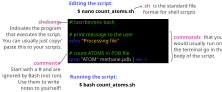

# Tworzenie skryptów powłoki (Shell scripts)

::: {.callout-tip}
## Cele szkolenia

- Tworzyć i edytować pliki tekstowe bezpośrednio z wiersza poleceń za pomocą edytora `nano`.
- Pisać skrypty powłoki (`.sh`) automatyzujące wykonanie sekwencji poleceń dla danych satelitarnych.
- Uruchamiać skrypty powłoki i dzielić długie potoki na wiele wierszy za pomocą `\`.
- Stosować polecenie `echo` do formatowania komunikatów dla użytkownika.

:::

## Czym są skrypty powłoki?

Do tej pory wpisywaliśmy polecenia pojedynczo w trybie interaktywnym.  
Aby jednak zautomatyzować przetwarzanie danych i zapewnić powtarzalność analiz inżynierskich, sekwencję poleceń zapisujemy w pliku tekstowym z rozszerzeniem `.sh`. Taki plik nazywamy **skryptem powłoki** (*shell script*).

Dzięki skryptom możemy jednym poleceniem uruchomić potok przetwarzający tysiące plików metadanych, zdjęć satelitarnych czy logów stacji naziemnych.

Załóżmy, że chcemy regularnie sprawdzać liczbę błędów w logach telemetrycznych stacji Spitsbergen:

```bash
cat telemetry_logs/ground_station_SVB_*.log | grep "ERROR" | wc -l
```

## Edycja plików w terminalu (`nano`)

W środowisku wiersza poleceń podstawowym edytorem tekstowym jest `nano`.

Przejdźmy do katalogu danych i utwórzmy nowy skrypt:

```bash
cd ~/Desktop/dane_do_cwiczen
nano check_telemetry.sh
```

W otwartym oknie edytora wpisz poniższy kod:

```bash
#!/usr/bin/env bash

# Skrypt analizujacy bledy w logach telemetrycznych stacji SVB
echo "Liczba zarejestrowanych bledow na stacji Spitsbergen (SVB):"
cat telemetry_logs/ground_station_SVB_*.log | grep "ERROR" | wc -l
```

Kluczowe elementy skryptu:
- `#!/usr/bin/env bash` – tzw. **shebang** (lub *hashbang*). Informuje system operacyjny, jakiego interpretera należy użyć do wykonania pliku.
- Linie zaczynające się od znaku `#` to **komentarze**. Są ignorowane przez interpreter i służą do opisywania logiki skryptu dla autorów i współpracowników.

### Zapisywanie i wychodzenie z `nano`
1. Naciśnij skrót <kbd>Ctrl</kbd> + <kbd>X</kbd> (wyjście).
2. Na pytanie `Save modified buffer?` naciśnij <kbd>Y</kbd> (Yes / Tak).
3. Potwierdź nazwę pliku, naciskając <kbd>Enter ↵</kbd>.

::: {.callout-note}
#### Edytory tekstu w pracy inżynierskiej
- **W terminalu:** `nano` (prosty i intuicyjny), `vim` / `neovim` lub `emacs` (zaawansowane, wysoce konfigurowalne narzędzia terminalowe).
- **Interfejs graficzny:** [Visual Studio Code](https://code.visualstudio.com/) (rekomendowane zintegrowane środowisko z obsługą wtyczek WSL, SSH, Git i Pythona).
:::

## Uruchamianie skryptu

Skrypt uruchamiamy, przekazując jego nazwę do interpretera `bash`:

```bash
bash check_telemetry.sh
```

```output
Liczba zarejestrowanych bledow na stacji Spitsbergen (SVB):
24
```

Uruchomienie skryptu wykonuje dokładnie te same instrukcje, co wpisanie ich ręcznie w terminalu, ale gwarantuje:
1. **Powtarzalność (Reproducibility)** – każdy krok jest udokumentowany i wykonywany w tej samej kolejności.
2. **Oszczędność czasu** – złożone zadania można uruchamiać cyklicznie jednym poleceniem.
3. **Współdzielenie w zespole** – skrypt można umieścić w repozytorium Git (np. w ramach zarządzania projektem informatycznym).

## Dzielenie długich poleceń na wiele wierszy (`\`)

W potokach przetwarzania danych satelitarnych polecenia z wieloma parametrami bywają bardzo długie. Aby poprawić ich czytelność, używamy znaku ukośnika wstecznego `\\` (*line continuation*):

```bash
#!/usr/bin/env bash

# Czytelny potok wieloliniowy
cat cloud_cover_reports/poland_sentinel2_2024.csv | \
  cut -d "," -f 4 | \
  grep -v "tile_id" | \
  sort | \
  uniq -c | \
  sort -n -r
```

::: {.callout-important}
Znak `\` musi być **ostatnim znakiem w linii** – nie może po nim występować spacja ani żaden inny znak!
:::

## Ćwiczenia

:::{.callout-exercise}
#### Skrypt generujący raport czystych scen dla Polski


Utwórz w edytorze `nano` skrypt `count_clean_scenes.sh`, który:
1. Wypisze komunikat: `Raport scen o niskim zachmurzeniu (Polska 2024):`
2. Wyszuka sceny z jakością `PASSED` w pliku `cloud_cover_reports/poland_sentinel2_2024.csv`.
3. Zliczy łączną liczbę takich scen i wypisze wynik na ekranie.

::: {.callout-answer collapse=true}

W `nano count_clean_scenes.sh`:

```bash
#!/usr/bin/env bash

echo "Raport scen o niskim zachmurzeniu (Polska 2024):"
grep "PASSED" cloud_cover_reports/poland_sentinel2_2024.csv | wc -l
```

Uruchomienie:
```bash
bash count_clean_scenes.sh
```
:::
:::

## Podsumowanie

{fig-alt="Diagram podsumowujący budowę skryptu: shebang, komentarze i kod poleceń"}

::: {.callout-tip}
#### Główne punkty

- Edytor `nano` pozwala na szybkie tworzenie i edycję plików bezpośrednio w terminalu.
- Skrypty powłoki zapisujemy z rozszerzeniem `.sh`.
- Skrypt rozpoczynamy nagłówkiem *shebang*: `#!/usr/bin/env bash`.
- Skrypt uruchamiamy poleceniem `bash nazwa_skryptu.sh`.
- Znak `\` na końcu linii pozwala przenieść długie polecenie do kolejnego wiersza.
:::
